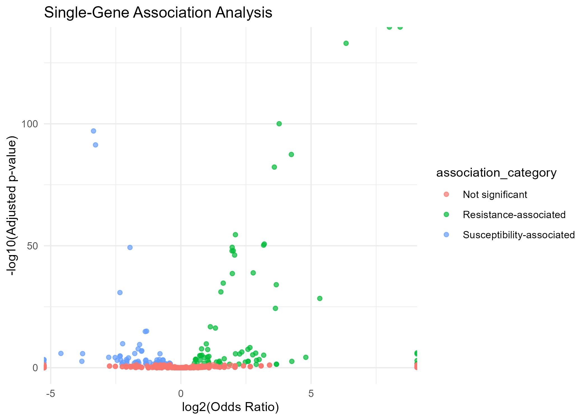

# Genomic Biomarkers and Co-Resistance Patterns of Carbapenem Resistance in *Klebsiella pneumoniae*

## Project Overview

This project investigates genomic features associated with carbapenem resistance in *Klebsiella pneumoniae* by integrating antimicrobial resistance phenotype data with AMR gene presence/absence profiles from BV-BRC.

The study aimed to identify candidate genomic features associated with meropenem resistance, characterize co-resistance patterns, and examine genotype–phenotype inconsistencies observed in public AMR datasets. In particular, it evaluates whether AMR gene profiles can explain meropenem resistance and whether genotype–phenotype mismatches reveal alternative resistance mechanisms or limitations of public AMR annotations.

---

## Why This Project Matters

Carbapenem-resistant *K. pneumoniae* is a major global health threat. Understanding how genomic features relate to resistance is important for improving surveillance, diagnostics, and treatment strategies.

This project goes beyond simple gene detection by:

- performing statistical association analysis  
- exploring co-resistance patterns  
- investigating biologically meaningful exception cases  

---

## Dataset

- Source: BV-BRC (Bacterial and Viral Bioinformatics Resource Center)  
- Organism: *Klebsiella pneumoniae*  
- Antibiotic: meropenem  

**Final dataset:**
- Total genomes: 2,444  
- Resistant: 786  
- Susceptible: 1,658  

**Features:**
- Binary AMR gene matrix (881 genes)  
- Carbapenemase marker groups:
  - blaKPC  
  - blaNDM  
  - blaOXA-48-like  
  - blaVIM  
  - blaIMP  

---

## Data Acquisition

Raw data were obtained from the BV-BRC database.

A hybrid acquisition approach was used due to dataset size and platform constraints:

- Genome metadata were downloaded manually after filtering for:
  - Organism: *Klebsiella pneumoniae*  
  - Genome quality: Complete, good quality genomes  

- Phenotype data were downloaded manually after filtering for:
  - Antibiotic: meropenem  
  - Phenotype: Resistant or Susceptible  

- AMR gene annotations were downloaded separately and processed in R due to file size and formatting constraints.

Raw files are not included in this repository due to size and database access constraints.  
See `data/raw/README.md` for details.

---

## Tech Stack

- R (tidyverse, pheatmap, broom)  
- Statistical methods: Fisher’s exact test, Wilcoxon rank-sum test  
- Data source: BV-BRC  

---

## Methods

- Data cleaning and cohort construction  
- Binary AMR gene matrix generation  

**Single-gene association analysis**
- Fisher’s exact test  
- Odds ratio calculation  
- Benjamini–Hochberg correction  

**Carbapenemase marker analysis**

**AMR gene burden comparison**
- Wilcoxon rank-sum test  

**Co-resistance analysis**
- Gene co-occurrence patterns  
- Filtered to AMR-relevant genes  

**Exception analysis**
- Resistant without carbapenemase  
- Susceptible with carbapenemase  

---

## Key Findings

- **KPC-associated genes** showed the strongest association with resistance  
- Carbapenem resistance occurred within a broader **multidrug resistance background**  
- **NDM and OXA-48-like markers** showed variable agreement with phenotype  
- Resistant isolates without carbapenemase markers were enriched for:
  - efflux-related genes (*emrB*, *emrD*, *oqxB*)  
  - regulatory genes (*marR*)  
  - membrane-associated genes (*arnT*)  

Approximately **22% of isolates showed genotype–phenotype mismatches**, indicating that carbapenem resistance cannot be reliably inferred from gene presence alone. This highlights the importance of regulatory effects, gene functionality, and alternative resistance mechanisms in genomic surveillance.

---

## Key Visualization

---

## Limitations

- Gene presence does not confirm expression or activity  
- Public AMR annotations may include partial or non-functional genes  
- Resistance mechanisms involving mutations or regulation were not directly tested  
- Association does not imply causation  

---

## Repository Structure

crkp_genomic_biomarkers/\
├── data/\
├── scripts/\
├── results/\
├── plots/\
├── report/\
└── README.md

---

## How to Reproduce

Run the analysis in R by executing scripts sequentially from the `scripts/` folder:

01_clean_metadata_and_phenotype.R\
02_clean_amr_genes.R\
03_define_final_cohort.R\
04_gene_matrix.R\
05_add_marker_columns.R\
06_dataset_summary.R\
07_single_gene_association.R\
08_carbapenemase_marker_analysis.R\
09_co_resistance_analysis.R\
10_exception_analysis.R\
11_exception_deep_dive.R
