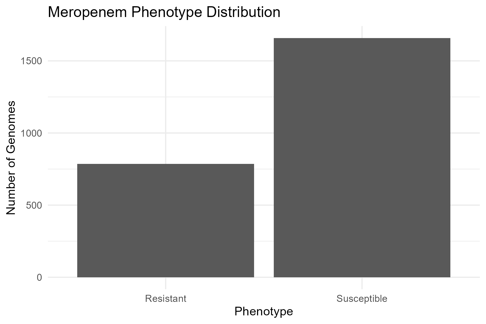
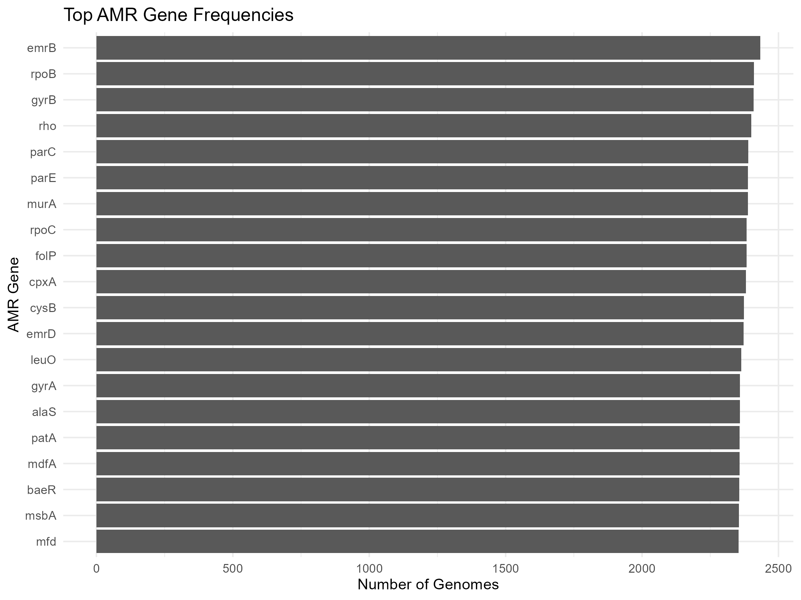
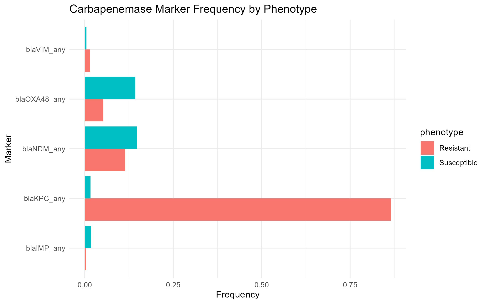
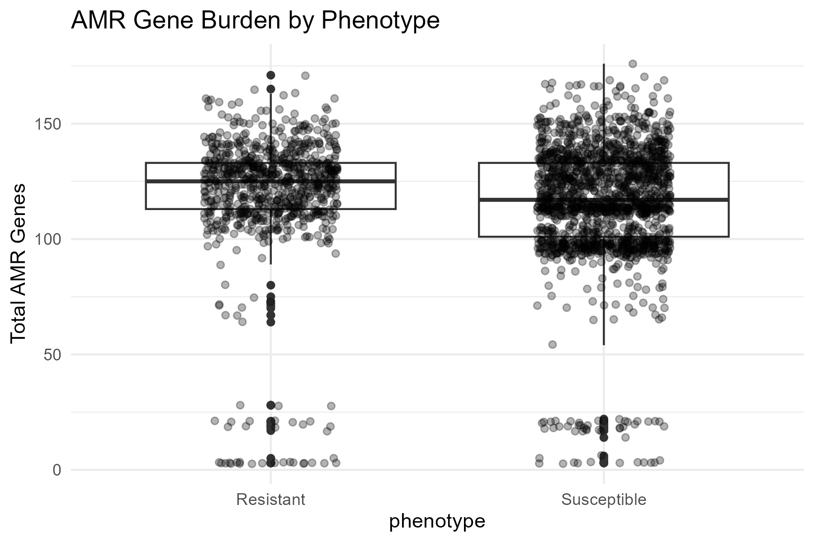
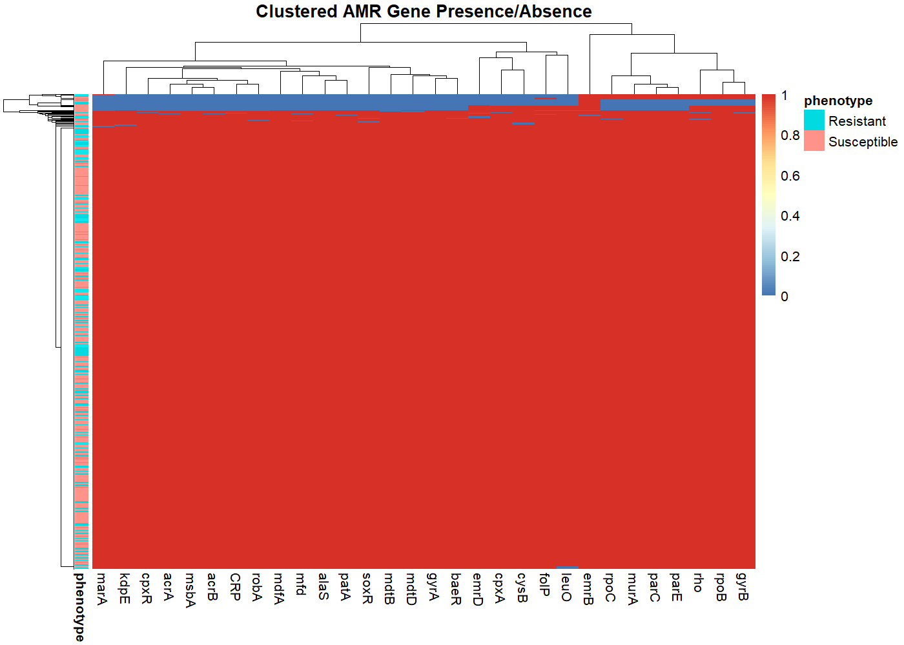
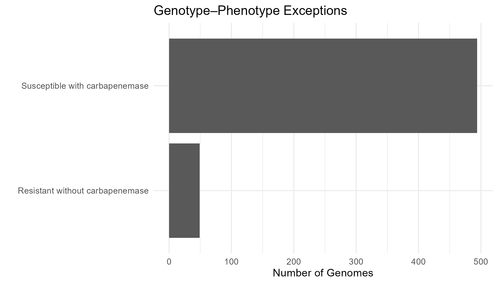

# 1. Project Overview

This project investigates genomic features associated with carbapenem resistance in *Klebsiella pneumoniae* by integrating antimicrobial resistance phenotype data with AMR gene presence/absence profiles from BV-BRC.

The study aimed to identify candidate genomic features associated with meropenem resistance, characterize co-resistance patterns, and examine genotype–phenotype inconsistencies observed in public AMR datasets. In particular, it evaluates whether AMR gene profiles can explain meropenem resistance and whether genotype–phenotype mismatches reveal alternative resistance mechanisms or limitations of public AMR annotations.

# 2. Biological Background

*Klebsiella pneumoniae* is an opportunistic pathogen associated with hospital-acquired infections, including pneumonia, bloodstream infections, and urinary tract infections. Carbapenems are often used as last-resort antibiotics for multidrug-resistant Gram-negative infections, making carbapenem resistance a major public health concern.

Resistance is commonly mediated by carbapenemase enzymes such as *blaKPC*, *blaNDM*, and *blaOXA-48-like* variants. However, resistance can also involve additional mechanisms, including efflux pump activity, reduced membrane permeability, porin alterations, and regulatory changes (Nordmann et al., 2011; Logan and Weinstein, 2017).

# 3. Dataset and Processing Strategy

Data were obtained from the BV-BRC database.

### Filtering criteria

-   Organism: *Klebsiella pneumoniae*
-   Antibiotic: meropenem
-   Phenotypes: Resistant or Susceptible only

### Final dataset

-   Total genomes: 2,444
-   Resistant: 786
-   Susceptible: 1,658

AMR gene annotations were converted into a binary matrix, where gene presence was encoded as 1 and absence as 0. Carbapenemase gene variants were grouped into broader marker categories:

-   *blaKPC*
-   *blaNDM*
-   *blaOXA-48-like*
-   *blaVIM*
-   *blaIMP*

# 4. Methods

## 4.1 Single-Gene Association Analysis

For each AMR gene, Fisher’s exact test was used to evaluate association between gene presence and meropenem resistance. This test was selected because both the phenotype and gene presence variables were categorical.

Odds ratios were calculated to describe the direction and magnitude of association. P-values were adjusted using the Benjamini–Hochberg method to reduce false discovery risk due to multiple testing.

## 4.2 AMR Gene Burden

Total AMR gene count was calculated for each genome. AMR burden was compared between resistant and susceptible isolates using a Wilcoxon rank-sum test.

## 4.3 Co-Resistance Analysis

Gene co-occurrence patterns were explored using resistance-associated genes rather than simply using the most frequent genes. This reduced the influence of broadly distributed core or housekeeping-associated genes and focused the heatmap on genomic features more relevant to resistance patterns.

## 4.4 Exception Analysis

Two genotype–phenotype exception groups were examined:

-   Resistant isolates without detected carbapenemase genes
-   Susceptible isolates with detected carbapenemase genes

# 5. Results

## 5.1 Phenotype Distribution



The final dataset contained 2,444 *K. pneumoniae* genomes. Of these, 786 were resistant and 1,658 were susceptible to meropenem. Although the dataset was imbalanced, both phenotype groups were sufficiently represented for association analysis.

## 5.2 AMR Gene Frequencies



Highly frequent genes such as *emrB*, *rpoB*, *gyrB*, and *rho* were present in nearly all genomes. These genes represent broadly distributed or core-associated genes and are not specific indicators of carbapenem resistance.

This showed that raw gene frequency alone was not sufficient to identify resistance-associated markers.

## 5.3 Single-Gene Association Analysis


```{r echo=FALSE, message=FALSE, warning=FALSE, paged.print=FALSE} 
library(readr) 
library(dplyr) 
library(knitr) 
association_results <- read_csv("../results/statistics/association_results.csv", show_col_types = FALSE)
association_results |> 
  select(gene, odds_ratio, adjusted_p_value) |>
  arrange(adjusted_p_value) |> 
  head(5) |> 
  kable(caption = "Top 5 Significant Genes from Single-Gene Association Analysis")
```


KPC-associated genes showed the strongest association with meropenem resistance. In particular, *KPC_2* and *KPC_family* had very high odds ratios above 250 and highly significant adjusted p-values.

Other associated genes included *CTX-M* variants, such as *CTX_M_65*, and aminoglycoside resistance genes such as *rmtB*. These findings indicate that carbapenem resistance in this dataset occurs within a broader multidrug resistance background.

Some genes, including *oqxA* and *oqxB*, were statistically significant but had odds ratios below 1, meaning they were more common in susceptible isolates in this dataset. This highlights why both statistical significance and odds ratio direction need to be interpreted together.

## 5.4 Carbapenemase Marker Distribution

Most resistant isolates carried at least one carbapenemase-associated marker:

-   737 out of 786 resistant isolates (93.8%)

-   494 out of 1,658 susceptible isolates (29.8%)



KPC-associated markers showed strong agreement with the resistant phenotype. *blaKPC_any* was present in 680 out of 786 resistant isolates, but only 27 out of 1,658 susceptible isolates.

In contrast, *NDM* and *OXA-48-like* markers showed more variable distributions across phenotypes. This may reflect a combination of biological variability and dataset-level annotation effects, including incomplete gene fragments, non-functional variants, or gene calls based on sequence similarity without confirmation of functional activity.

## 5.5 AMR Gene Burden



Resistant isolates had a slightly higher AMR gene burden than susceptible isolates:

-   Resistant mean AMR gene count: 120

-   Susceptible mean AMR gene count: 116

This difference was statistically significant using the Wilcoxon rank-sum test (p = 1.97 × 10\^-10), but the magnitude of the difference was small.

This suggests that carbapenem resistance is more strongly associated with specific resistance genes and gene combinations than with overall AMR gene count.

## 5.6 Co-Resistance Patterns



The heatmap was restricted to resistance-associated genes to reduce the influence of core or broadly distributed genes.

Co-occurrence patterns were observed among several AMR-related genes, including:

-   *oqxA* and *oqxB*, an efflux-associated gene pair

-   *marR*, a regulatory gene linked to multidrug resistance regulation

-   *fosA* and other multidrug resistance-associated genes

These patterns suggest possible co-selection of resistance determinants within shared genomic backgrounds. However, plasmid location was not directly tested in this analysis.

## 5.7 Genotype–Phenotype Exceptions



Two genotype–phenotype exception groups were identified:

-   49 resistant isolates lacked detected carbapenemase genes

-   494 susceptible isolates carried at least one carbapenemase-associated marker

Together, these exception cases represented approximately 22.2% of the dataset. This indicates that carbapenemase marker presence was strongly informative but not perfectly consistent with phenotype in this dataset.

## 5.8 Exception Deep Dive

Among resistant isolates without detected carbapenemase genes, several AMR-related genes were frequently observed:

-   *emrB*: present in 48 out of 49 isolates

-   *emrD*

-   *oqxB*

-   *acrA*, *acrB*, and *acrR*

-   *marR*

-   *arnT*

-   *fosA*

These genes suggest possible alternative resistance-related mechanisms, including efflux activity, regulatory changes, and membrane-associated changes.

However, these findings should be interpreted as candidate mechanisms only. Gene presence does not prove that these genes caused meropenem resistance.

# 6. Interpretation

The strongest resistance-associated signal in this dataset came from KPC-associated genes, especially *KPC_2* and *KPC_family*. This is consistent with the known role of KPC carbapenemases in carbapenem resistance.

The association of other genes, such as *CTX_M_65*, *rmtB*, *TEM* family genes, and *SHV* variants, suggests that carbapenem resistance occurs within a broader multidrug resistance background.

The behavior of carbapenemase groups was not uniform. KPC-associated markers showed strong agreement with resistant phenotypes, while *NDM* and *OXA-48-like* markers showed more variable patterns. This suggests that grouped carbapenemase calls should be interpreted carefully in public datasets.

Exception cases were useful for identifying possible mechanisms not captured by carbapenemase markers alone. Resistant isolates without carbapenemase genes showed enrichment of efflux-associated, regulatory, and membrane-associated genes. Susceptible isolates with carbapenemase markers likely reflect a mixture of biological variability and public database annotation limitations.

# 7. Limitations

This analysis has several limitations:

-   Gene presence does not confirm gene expression or protein function

-   Partial or fragmented gene annotations may be included

-   Phenotype data originate from multiple sources and may vary by testing method, MIC threshold, or laboratory standard

-   Resistance mechanisms involving point mutations, gene regulation, porin disruption, or expression changes were not directly tested

-   Gene naming variability may affect gene-level interpretation

-   Statistical association does not prove causation

# 8. Conclusion

This analysis identified carbapenemase genes, particularly *blaKPC*-associated variants, as the strongest genomic features associated with carbapenem resistance in *Klebsiella pneumoniae*.

Additional genes, including *CTX-M* variants and aminoglycoside resistance genes such as *rmtB*, were also associated with resistant isolates, reflecting broader co-resistance patterns.

A subset of isolates showed genotype–phenotype mismatches, including resistant isolates without detected carbapenemase genes and susceptible isolates carrying carbapenemase markers. Analysis of the resistant exception group showed frequent presence of efflux-related genes (*emrB*, *emrD*, *oqxB*, *acrAB*), regulatory genes (*marR*), and membrane-associated genes (*arnT*).

Overall, the results show that carbapenem resistance in this dataset was mainly associated with specific high-impact genes, especially KPC-associated markers, while additional genomic context contributed to variation observed across isolates.

# 9. References

Nordmann, P., Naas, T., & Poirel, L. (2011). Global spread of Carbapenemase-producing Enterobacteriaceae. Emerging Infectious Diseases, 17(10), 1791–1798. <https://doi.org/10.3201/eid1710.110655>

Logan, L. K., & Weinstein, R. A. (2017). The Epidemiology of Carbapenem-Resistant Enterobacteriaceae: The Impact and Evolution of a Global Menace. The Journal of Infectious Diseases, 215(suppl_1), S28–S36. <https://doi.org/10.1093/infdis/jiw282>

World Health Organization. (2024). WHO bacterial priority pathogens list, 2024: Bacterial pathogens of public health importance to guide research, development and strategies to prevent and control antimicrobial resistance. <https://www.who.int/publications/i/item/9789240093461>

Bacterial and Viral Bioinformatics Resource Center (BV-BRC). <https://www.bv-brc.org/>
